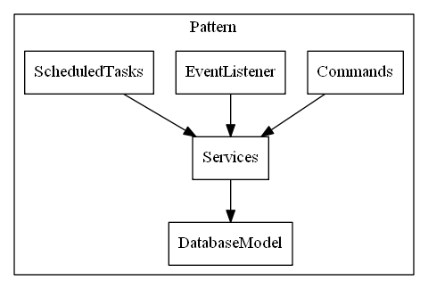

# PluginUtils #
Contains useful classes for Bukkit plugins.

# ChatApi #
Message resource files must have UTF-8 encoding too.

# CommandApi #
CommandApi is a command parser and handler for Bukkit. It deals with incoming console and player commands and dispatches them to the appropriate Java classes.

## `@Command` ##
This annotation mark a method as command method.

Command methods must be `public`, not `static` and can easy defined by annotations. The return type will be ignored, for clean code recommended is `void`. The parameters of command methods can be named as you wish, only the type and order is fixed.

Annotation parameters are:
### main ###
Defined the 1st chat parameter, e.g.: `/tell`

The parameter is **required**. Can be defined as single string or string array (for aliases). It can not be assigned multiple methods with the same main alias, without any further restrictions (eq.: sub, min, max, world, permission). Spaces are not allowed here.

```java
// using simple string, chat command is: /tell some text
@Command(main = "tell")
public void whisper(Player player, String[] args) {
    // do something
}
```
```java
// using string array for aliases, chat commands are:
// /teleport somewhere
// /tp somewhere
@Command(main = {"teleport", "tp"})
public void teleport(Player player, String[] args) {
    // do something
}
```

### sub ###
Defined the 2nd chat parameter, e.g.: `/ch l`

The parameter is **optional**, default value is emtpy. Can be defined as single string or string array (for aliases).  It can not be assigned multiple methods with the same sub alias, without any further restrictions (eq.: main, min, max, world, permission). Spaces are not allowed here.

```java
// using simple string, chat command is: /member add some_member
@Command(main = "member", sub = "add")
public void addMember(Player player, String[] args) {
    // do something
}
```
```java
// using string array for aliases, chat commands are:
// /ch l
// /ch local
@Command(main = "ch", sub = {"local", "l"})
public void changeToLocal(Player player, String[] args) {
    // do something
}
```

### min & max ###
The `min` and `max` parameter specify the count of additional chat parameters. The count starts after `sub`-command-name, if `sub`-command-name is not set then start after `main`-command-name.
If the count of chat parameters not equals with command `min`/`max` specification, then the command will **not** called, this allows polymorphy for chat commands.

Both parameters are **optional**. Default value for `min` is 0 and for `max` is -1 -> unlimited.

```java
// chat command is: /time
@Command(main = "time", max = 0)
public void displayCurrentTimeOwnWorld(Player player, String[] args) {
    // do something
}

// chat command is: /time other_world
@Command(main = "time", min = 1, max = 1)
public void displayCurrentTimeOtherWorld(Player player, String[] args) {
    // do something
}

// chat command is: /time other_world_1 other_world_2
@Command(main = "time", min = 2)
public void displayCurrentTimeOtherWorlds(Player player, String[] args) {
    // do something
}
```

If `max` is set to 0 the `String[] args` parameter of command method can be omitted.

```java
// chat command is: /time
@Command(main = "time", max = 0)
public void displayCurrentTime(Player player) {
    // do something
}
```

If `min` and `max` is set to 1 the `String[] args` parameter of command method can be changed to `String arg`.

```java
// chat command is: /member add notch
@Command(main = "member", sub = "add", min = 1, max = 1)
public void addMember(Player player, String playerName) {
    // do something
}
```

### help ###
The `help` parameter specify only user help info for the chat command. It will be automatic generate additional sub command `help` and not called the real command method.

The parameter is **optional**, default value is emtpy.

```java
// chat command is: /time help
// it will display: /time - print current time
@Command(main = "time", help = "print current time")
public void displayCurrentTime(Player player, String[] args) {
    // do something
}
```

### usage ###
It's only an additional info for help.

The parameter is **optional**, default value is emtpy.

```java
// chat command is: /member add notch
// it will display: /member add [player] - adds the player
@Command(main = "member", sub = "add", min = 1, max = 1, usage = "[player]", help = "adds the player")
public void addMember(Player player, String playerName) {
    // do something
}
```

## `@Asynchron` ##
The command method will be called in a separate thread (not bukkit tick thread). All access to Bukkit **must** be explicitly done in Bukkit Thread.

```java
@Command(main = "work")
@Asynchron
public void doSomeLongWork(Player player, String[] args) {
    // do something external work
}
```

To easy switch *bukkit thread* to *non bukkit thread* and back you can use `TaskManager.syncTask()` or `TaskManager.asyncTask()`. The Thread will automaticaly insert in bukkit task queue or detached from there.

```java
@Command(main = "work")
@Asynchron
public void doSomeLongWork(Player player, String[] args) {
    // do something external work
    
    TaskManager.syncTask();

    // do some bukkit stuff
    
    TaskManager.asyncTask();
    
    // do something external work
}

@Command(main = "work")
public void doSomeLongWork(Player player, String[] args) {
    // do some bukkit stuff
    
    TaskManager.asyncTask();
    
    // do something external work
      
    TaskManager.syncTask();
    
    // do some bukkit stuff
}
```

## `@CommandPermissions` ##
The command method will only called if the player has the specified permissions. Can be defined as single string or string array (for more permissions).

```java
@Command(main = "work")
@CommandPermissions("permission.admin")
public void doAdminStuff(Player player, String[] args) {
    // do something
}
```

## `@CommandPermissionsNot` ##
The command method will only called if the player has not the specified permissions. Can be defined as single string or string array (for more permissions).

```java
@Command(main = "work")
@CommandPermissionsNot("permission.admin")
public void doUserStuff(Player player, String[] args) {
    // do something
}
```

```java
@Command(main = "work")
@CommandPermissions({"permission.admin", "permission.mod"})
public void doAdminAndModStuff(Player player, String[] args) {
    // do something
}
```

## `@World` ##
The command method will only called if the player located in the specified world. Can be defined as single string or string array (for more worlds).

```java
@Command(main = "work")
@World("event")
public void doEventStuff(Player player, String[] args) {
    // do something
}
```

```java
@Command(main = "work")
@World({"world1", "world2"})
public void doMultiWorldStuff(Player player, String[] args) {
    // do something
}
```

## `@NeededPlugin` ##
The command method will only called if the specified plugin is enabled. Can be defined as single string or string array (for more plugins).

```java
@Command(main = "work")
@NeededPlugin("LWC")
public void lwcChanges(Player player, String[] args) {
    // do something
}
```

```java
@Command(main = "work")
@NeededPlugin({"WorldEdit", "WorldGuard"})
public void worldChanges(Player player, String[] args) {
    // do something
}
```

Recommended is use of plugin names from WrapperApi.

```java
@Command(main = "dynmap", sub = "refresh")
@NeededPlugin(WrapperManager.PLUGIN_NAME_DYNMAP)
public void refreshDynMap(Player player, String[] args) {
    // do something
}
```

## command sender annotations ##
Command sender can be specified, default is player (`@SenderPlayer`). The parameter type of the sender must be the first parameter and correct defined (`org.bukkit.entity.Player`, `org.bukkit.command.ConsoleCommandSender`, `org.bukkit.command.BlockCommandSender` or `org.bukkit.command.RemoteConsoleCommandSender`) or universal via `org.bukkit.command.CommandSender`. Multi use of sender annotation is allowed, then the sender must be the universal `org.bukkit.command.CommandSender`.

### `@SenderBlock` ###
The command sender must be a block.

```java
@Command(main = "block")
@SenderBlock
public void blockWork(BlockCommandSender block, String[] args) {
    // do something
}
```

### `@SenderConsole` ###
The command sender must be the console.

```java
@Command(main = "save")
@SenderConsole
public void saveWorld(ConsoleCommandSender console, String[] args) {
    // do something
}
```

### `@SenderPlayer` ###
The command sender must be a player. It's the default command sender and must only set if another command sender annotation is used too.

```java
@Command(main = "universal_action")
@SenderPlayer
@SenderConsole
public void doAction(CommandSender sender, String[] args) {
    // do something
}
```

### `@SenderRemoteConsole` ###
The command sender must be a remote console.

```java
@Command(main = "save")
@SenderRemoteConsole
public void saveWorld(RemoteConsoleCommandSender remoteConsole, String[] args) {
    // do something
}
```

# ConfirmApi #
TODO

# PermissionApi #
Simple permission interface for easy use. Bukkit core permission methods is used, if PermissionEx plugin is not available.

# PluginApi #
New base class `BasePlugin` for Bukkit plugins with standard services (PermissionService, ChatService, CommandsManager, ConfirmService).
For easy extend, overwrite following hook methods:
- preEnableActions
- postEnableActions
- initialCustomServices
- startCustomServices
- stopCustomServices
- preCommandAction
- registerCommands
- initialCustomEventListeners
- registerCustomEventListeners
- registerDatabaseModel
- migrateOldData
- getCustomDatabaseServer
- registerScheduledTasks
- createCustomErrorHandler



# WrapperApi #
Use WrapperApi for third party plugin integration. So it wouldn't need `depend` configuration in plugin.yml.
Before use, check WrapperManager.isPluginEnabled if plugin is available.
  
Available wrapper classes:
- dynmap (finished)
- LogBlock (finished)
- LWC (not finished)
- Herochat (finished)
- MultiverseCoreWrapper (finished)
- PermissionsEx (not finished)
- Shopkeepers (not finished)
- VanishNoPacket (not finished)
- Vault (not finished)
- WorldEdit (not finished)
- WorldGuard (not finished)

---

License: The MIT License (MIT)

Copyright (c) 2013 Cube-Nation (Björn Teichmann)

Permission is hereby granted, free of charge, to any person obtaining a copy
of this software and associated documentation files (the "Software"), to deal
in the Software without restriction, including without limitation the rights
to use, copy, modify, merge, publish, distribute, sublicense, and/or sell
copies of the Software, and to permit persons to whom the Software is
furnished to do so, subject to the following conditions:

The above copyright notice and this permission notice shall be included in
all copies or substantial portions of the Software.

THE SOFTWARE IS PROVIDED "AS IS", WITHOUT WARRANTY OF ANY KIND, EXPRESS OR
IMPLIED, INCLUDING BUT NOT LIMITED TO THE WARRANTIES OF MERCHANTABILITY,
FITNESS FOR A PARTICULAR PURPOSE AND NONINFRINGEMENT. IN NO EVENT SHALL THE
AUTHORS OR COPYRIGHT HOLDERS BE LIABLE FOR ANY CLAIM, DAMAGES OR OTHER
LIABILITY, WHETHER IN AN ACTION OF CONTRACT, TORT OR OTHERWISE, ARISING FROM,
OUT OF OR IN CONNECTION WITH THE SOFTWARE OR THE USE OR OTHER DEALINGS IN
THE SOFTWARE.
